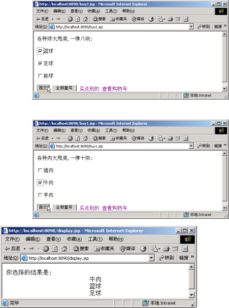

# hdu_javaee
  杭电javaee课的上机作业

### 第一次上机：
要求详见实训一doc文件  
  
  
  
### 第二次上机：

> * 编写一个jsp页面为count.jsp，用来计算访问本网页的人数，页面显示的内容为“你是第*个访问本网页的访客”
> * 编写一个jsp页面time.jsp,用来显示服务器时间跟客户端时间。显示内容为：“服务端时间为……；客户端时间为******”。测试的时候为了能够显示出服务端时间跟客户端时间的不同，需要使得客户端与服务端为不同的电脑（可以互相访问周边同学的电脑）。
> * 编写一个jsp页面week.jsp，用来显示当前是星期几，以及上下午，时间信息。显示内容为“今天是星期*\上下午\几点几分，”
> * 编写一个jsp页面为register.jsp，标题是“用户注册”，网页包括一个表单，内容有用户名，密码，籍贯，出生年月，性别，爱好，身高，邮箱，手机，个人介绍。其中的内容需要表单验证（js处理），包括用户名长度在6到10位之间且只能用字母开头，邮箱必须符合邮箱的格式，手机需要11位的号码等，当用户输入不符合规则的时候应该提醒，并明确提示什么类型的错误，只有符合规则以后才能正常提交到jsp页面（post.jsp）。Post.jsp的内容是，把表单的填写内容，通过列表的方式按顺序显示出来。
> * 简易session版购物车的制作，主要页面如下。

### 第三次上机

> * 创建jsp页面list.jsp ,功能:从数据库中读取students表的内容，并显示在网页上的表格中；另外在表格之前使用一个表单，表单中包含若干个text控件（text数跟students的字段数相同），以及一个submit按钮，可以模糊查询表中的内容，并且更新页面；在list.jsp页面的最下面，创建一个链接（链接到new.jsp），链接文字是“增加学生”。
> * 创建jsp页面new.jsp，内容是一个表单，表单项是students的字段的内容,以及submit和reset按钮。当点击submit按钮以后，请用js做简单的表单验证（包括字段非空验证），然后提交到页面newConfirm.jsp处理。
> * 创建页面newConfirm.jsp，功能是把前面表单的内容存储到数据库的表students中（不能违反数据库表的主键约束），然后显示提示信息“新建学生成功”，并且5秒以后跳转返回到页面list.jsp。